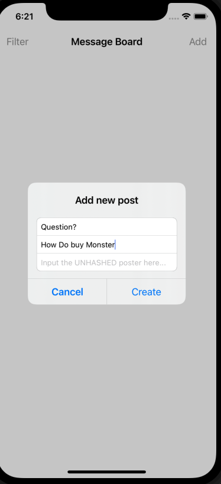
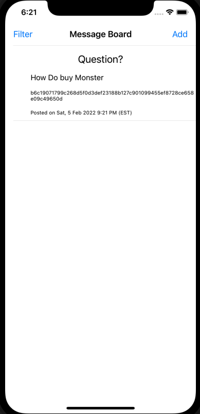

# CourseAppServerApp
Displaying a list of hashed post using alomfire and a remote server.

remote server Used (includes guide on how to use):
https://github.com/cuappdev/ios-course-messageboard

**Preview**

<table>
<tr>
<td width="25%">

Adding new post

</td>
<td width="25%">

Newsfeed

</td>
</tr>
<tr>
<td width="25%">
</img>
</td>
<td width="25%">
</img>
</td>

</tr>
</table>

Didnt do getPostersPosts to be able to complete the filtering functionality.
